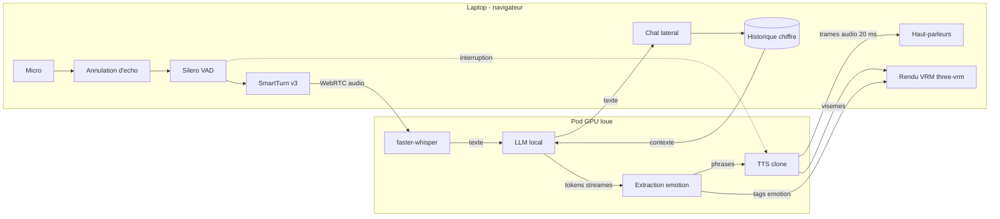
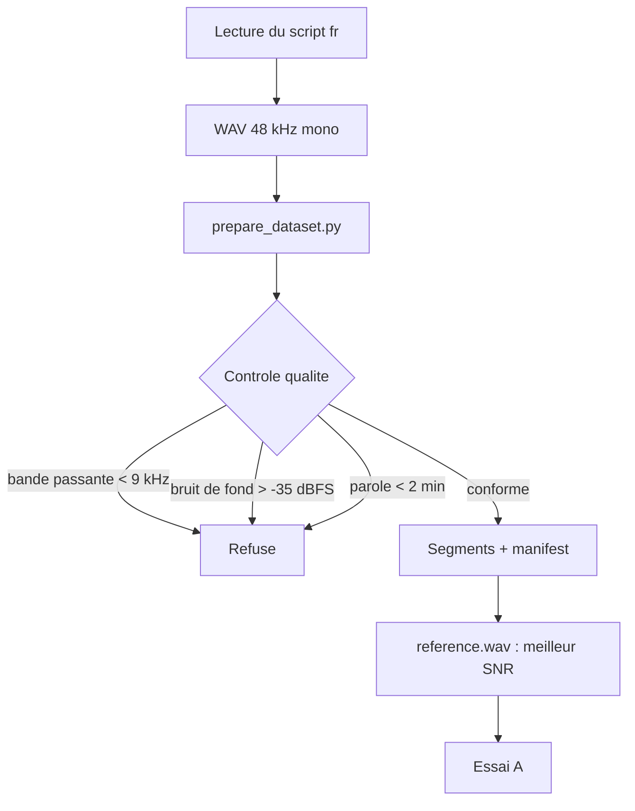
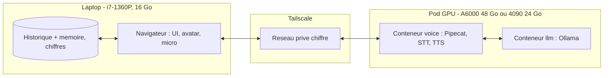

# Architecture - compagne IA conversationnelle auto-hebergee

Document de reference du projet. Il decrit le systeme cible, les briques
retenues et les raisons de chaque choix.

Deux precautions de lecture.

Ce document corrige le cahier des charges initial plutot qu'il ne l'execute.
Quatre de ses hypotheses ne tenaient pas a la verification, dont deux etaient
bloquantes. Les corrections et leur justification sont dans
[decisions.md](decisions.md).

Les chiffres de performance ne sont pas encore mesures. Le projet est en phase 0 :
deux essais instrumentes valident les points qui peuvent le tuer avant qu'on
construise par dessus. Les cases correspondantes sont marquees **a mesurer**, et
le verdict sera produit par [`bench/decide.py`](../bench/decide.py).

---

## 1. Vue d'ensemble

### 1.1 Les briques et leur role

| Brique | Role | Ou elle tourne |
|---|---|---|
| Capture et restitution audio | Micro, haut-parleurs, annulation d'echo | Navigateur, sur le laptop |
| VAD | Detecter qu'il y a de la parole | CPU, laptop |
| Detection de fin de tour | Distinguer une pause d'une fin de phrase | CPU, laptop |
| STT | Transcrire la parole en francais | GPU, pod |
| LLM | Personnalite, contexte, conduite du dialogue | GPU, pod |
| Canal emotion | Extraire le ton du propos et le router | CPU, pod |
| TTS clone | Produire la voix de la persona | GPU, pod |
| Avatar | Rendu, lip-sync, expressions, animations | GPU du client, navigateur |
| Memoire | Historique, resume, rappel a long terme | Laptop, chiffre |
| Orchestration | Enchainer, streamer, gerer les interruptions | Pod |

### 1.2 Circulation des donnees



Trois proprietes de ce schema meritent d'etre relevees, parce qu'elles sont la
raison d'etre de la structure.

**Aucune video ne transite.** L'avatar est rendu sur le GPU du client a partir
d'un flux de visemes et de tags. Encoder puis transmettre de la video ajouterait
un etage de latence entier et une charge GPU permanente sur le pod, pour un
resultat visuellement inferieur.

**L'annulation d'echo est dans le navigateur**, avant l'encodage. C'est le seul
endroit ou elle fonctionne : cote serveur, le signal de reference est deja
desynchronise par le reseau. Sans elle, en mains libres, le micro capte la voix
de l'avatar, le STT la transcrit, et le systeme se repond a lui-meme.

**L'interruption court-circuite la chaine.** Quand le VAD detecte de la parole
pendant que l'avatar parle, la generation en cours est annulee et l'audio en
attente est jete. C'est ce qui separe un appel d'un chatbot qui parle.

### 1.3 Repartition GPU et CPU

| Sur CPU | Pourquoi |
|---|---|
| VAD Silero | Modele ONNX minuscule ; sur le laptop il economise 150 a 200 ms de reseau par rapport a un VAD distant |
| SmartTurn v3 | Idem, et il doit repondre avant que le tour ne soit envoye |
| Annulation d'echo | Implementee par le navigateur |
| Extraction des tags d'emotion | Simple analyse du texte |

| Sur GPU | VRAM indicative |
|---|---|
| faster-whisper large-v3 | 3 a 4 Go |
| LLM 8B quantifie Q4 | 6 a 7 Go |
| TTS clone (0,5 a 1,7 B) | 3 a 5 Go |
| Marge de fragmentation | 2 a 3 Go |
| **Total** | **14 a 19 Go** |

Une carte 24 Go suffit donc, avec peu de marge. Une 48 Go est plus confortable
pour l'essai A, qui charge en plus le modele d'embedding locuteur et compare
plusieurs moteurs.

### 1.4 Budget de latence

Le cahier des charges demandait une "latence totale inferieure a X ms" sans
jamais definir X. Cible retenue et repartition indicative :

| Etage | Budget | Commentaire |
|---|---|---|
| Fin de parole detectee (VAD) | 200 ms | Sous ce seuil on coupe les hesitations |
| STT | 150 ms | faster-whisper sur segment court |
| LLM, premier token | 250 ms | Modele charge en permanence |
| TTS, premier son | 300 ms | Premiere phrase seulement, pas la reponse entiere |
| **Total, fin de parole au premier son** | **900 ms en p50, 1400 ms en p90** | **a mesurer** |
| Barge-in | 300 ms | **a mesurer** |

Un chiffre global ne suffit pas a optimiser : savoir qu'un tour prend 1,4 s ne
dit pas s'il faut changer de STT, quantifier le LLM ou decouper autrement le
texte. La sonde
[`instrumentation.py`](../bench/spike_b_latency/instrumentation.py) mesure donc
chaque etage separement, et le rapport designe l'etage dominant.

---

## 2. Choix par brique

Une recommandation et une alternative par brique, avec la raison du choix. Le
cahier des charges demandait deux a trois options comparees pour chacune ; cela
produit surtout du remplissage. Ce qui compte est le choix et sa justification.

### 2.1 STT

**Retenu : faster-whisper, modele `large-v3`.** Reimplementation de Whisper sur
CTranslate2, quatre fois plus rapide que l'originale a qualite egale, et le
francais est solide. Deja integre a Pipecat.

**Alternative : `large-v3-turbo` ou distil-whisper francais**, si l'essai B
designe le STT comme etage dominant. On echange un peu de precision contre de la
latence, arbitrage acceptable puisque le LLM tolere une transcription imparfaite.

Ecarte : Whisper.cpp, plus lent sur GPU. sherpa-onnx, excellent sur embarque
mais sans interet ici. Les API cloud, exclues par principe.

### 2.2 LLM

**Retenu : Ollama, modele 8B quantifie en Q4_K_M, format GGUF.** Ollama gere le
chargement, le maintien en memoire et une API stable, et Pipecat l'integre. Le
8B est le bon point : assez pour tenir une personnalite, assez petit pour un
premier token rapide et pour cohabiter avec le STT et le TTS sur 24 Go.

`OLLAMA_KEEP_ALIVE=24h` est indispensable. Par defaut le modele est decharge
apres quelques minutes, et le rechargement ajoute plusieurs secondes au premier
token : la conversation devient inutilisable apres chaque pause.

**Alternative : vLLM**, si le premier token devient le facteur limitant. Plus
rapide en regime soutenu, mais plus lourd a exploiter et sans interet pour un
seul utilisateur.

Dimensionnement selon la VRAM restante, une fois STT et TTS charges :

| VRAM libre | Modele |
|---|---|
| 6 a 8 Go | 8B en Q4_K_M |
| 10 a 14 Go | 12 a 14B en Q4 |
| 20 Go et plus | 24 a 32B en Q4, qualite de dialogue nettement superieure |

**Personnalite.** Un fichier par persona dans
[`backend/personas/`](../backend/personas/), charge comme message systeme. Le
point le plus important de ce fichier n'est pas la biographie du personnage mais
la **contrainte de format** : tout ce que le LLM produit sera lu a voix haute,
donc pas de listes, pas de markdown, pas d'emoji, et des reponses d'une a trois
phrases. Un modele qui repond en paragraphes detruit la sensation de
conversation quelle que soit la qualite de la voix.

**Memoire.** Trois niveaux, a construire en phase 2 :

1. contexte court, les N derniers tours dans la fenetre ;
2. resume glissant, regenere quand le contexte se remplit ;
3. memoire longue, base vectorielle interrogee par similarite.

Les trois vivent **cote laptop**. Le pod recoit le contexte assemble pour le tour
en cours et ne conserve rien.

**Finetune de personnalite.** Volontairement repousse. Un bon prompt systeme et
une memoire correcte couvrent la quasi-totalite du besoin, alors qu'un LoRA de
personnalite demande un dataset de dialogues, un entrainement et une evaluation
que rien ne justifie tant que la boucle vocale n'est pas satisfaisante.

### 2.3 TTS et clonage vocal

C'est la brique ou le cahier des charges se trompait le plus lourdement, et elle
est traitee en detail en [section 3](#3-la-brique-vocale-en-detail).

**Candidats : Chatterbox Multilingual v3** (Resemble AI, MIT, 0,5 B, francais
via `language_id="fr"`) et **Qwen3-TTS Base** (Alibaba, Apache, clonage a partir
d'environ trois secondes).

**Temoin : GPT-SoVITS v4**, pour mesurer l'ecart annonce plutot que le postuler.

Le choix final sort de l'essai A, pas de ce document.

### 2.4 Avatar

**Retenu : modele VRM rendu par `three-vrm` sur three.js, dans le navigateur.**

Le cahier des charges melangeait deux familles incompatibles. MuseTalk, SadTalker
et Wav2Lip generent une video de tete parlante : pas de corps, cout GPU par
image, et incapacite structurelle a produire "l'avatar se leve et fait des
pompes". Live2D et VRM sont des modeles riggés rendus en temps reel.

VRM plutot que Live2D :

- le passage buste vers plein pied est un changement de camera, alors qu'en
  Live2D il faudrait un second modele ;
- les animations corps entier viennent de Mixamo et se retargettent sur le
  squelette VRM, qui est standardise ;
- Live2D impose un `.moc3` produit par Cubism Editor, payant, avec une licence
  SDK commerciale.

**Lip-sync.** A partir de l'audio produit par le TTS, pas d'un modele dedie.
L'enveloppe d'energie par bande de frequence pilote les blendshapes de visemes
standard du format VRM (`aa`, `ih`, `ou`, `ee`, `oh`). C'est moins precis qu'un
alignement phonetique, mais cela ne coute rien, fonctionne quel que soit le
moteur TTS, et reste sous le seuil de perception a distance de conversation.
Un alignement phonetique reel n'a de sens qu'en gros plan.

**Expressions.** Pilotees par les tags d'emotion du LLM (decision D7), pas
deduites de l'audio. Le LLM sait ce qu'il exprime ; le deviner depuis le signal
serait a la fois moins fiable et plus cher.

**Reference a etudier : Open-LLM-VTuber**, qui implemente deja persona, mapping
emotion vers expression, interruption sans casque et mode hors ligne. Son rendu
est Live2D uniquement, mais les schemas sont transposables. Amica couvre VRM.

### 2.5 Orchestration

**Retenu : Pipecat**, en Python.

Il fournit exactement les briques que le cahier des charges avait omises :
`SileroVADAnalyzer`, `LocalSmartTurnAnalyzerV3`, `allow_interruptions`,
`SmallWebRTCTransport` en pair a pair sans service tiers. Il est agnostique du
transport et se branche sur des services locaux, ce qui preserve la modularite
exigee.

**Alternative : LiveKit Agents**, qui embarque son propre serveur de media.
Pertinent pour du multi-participant, de la telephonie ou de l'enregistrement.
Surdimensionne pour un appel a deux, et il faudrait exploiter un serveur de media
en plus.

Ecarte : une orchestration maison en FastAPI. Le cahier des charges la suggerait,
mais elle reviendrait a reimplementer le VAD, la detection de fin de tour et
l'annulation propre des generations en cours. C'est precisement la partie
difficile, et elle est deja resolue.

### 2.6 Frontend

**Retenu : application web** servie depuis le laptop. React ou Svelte, three.js
et `three-vrm` pour l'avatar, l'API WebRTC du navigateur pour l'audio.

Le navigateur n'est pas un choix par defaut : il apporte gratuitement
l'annulation d'echo, la suppression de bruit, le controle automatique de gain et
une pile WebRTC eprouvee. Les reimplementer dans une application native serait
un travail considerable pour un resultat inferieur.

Organisation de l'ecran : l'avatar occupe la zone principale, avec bascule buste
et plein pied ; le chat textuel est dans une colonne laterale avec l'historique,
les images et les extraits audio ; les controles (micro, scene, persona) sont en
bas.

Le HTTPS est obligatoire des que la page n'est pas servie depuis `localhost` :
les navigateurs n'autorisent l'acces au micro qu'en contexte securise.

---

## 3. La brique vocale en detail

### 3.1 Pourquoi GPT-SoVITS n'est pas au coeur du design

Le cahier des charges l'imposait comme brique principale pour cloner une voix
francaise a partir d'environ cinq minutes d'audio, avec un objectif de 90 % de
similarite. Ces trois exigences sont incompatibles.

GPT-SoVITS ne synthetise pas le francais. Les codes de langue de son frontend
sont `zh`, `en`, `ja`, `ko` et `yue`. Il n'existe aucun module de conversion
graphemes-phonemes francais dans le projet, et les modeles pre-entraines, de v1
a v4, n'ont jamais vu de phoneme francais. Un audio de reference francais
transfere bien le timbre ; le texte francais a synthetiser, lui, est phonetise
par le frontend d'une autre langue.

Le banc conserve GPT-SoVITS comme temoin, configure sur le frontend `en`, ce qui
est exactement la substitution que l'on veut mettre a l'epreuve. Le profil
attendu est une similarite locuteur correcte et un WER francais degrade. Si la
mesure contredit cette attente, c'est la mesure qui tranche.

### 3.2 Ce que "90 % de similarite" voulait dire

Rien de mesurable, en l'etat. La similarite cosinus entre embeddings locuteur
n'est pas interpretable dans l'absolu : deux enregistrements differents d'une
meme personne, faits avec le meme micro dans la meme piece, donnent typiquement
0,75 a 0,90, pas 1,0. Un objectif de 0,90 depassait donc ce que la voix reelle
obtient contre elle-meme.

Le banc mesure d'abord ce plafond sur le dataset, puis exprime chaque moteur en
pourcentage de celui-ci. C'est la seule facon de rendre le chiffre comparable.

### 3.3 Chaine de preparation du dataset



Le controle le plus utile est celui de la **bande passante**. Un enregistrement
48 kHz honnete porte de l'energie jusqu'a 16 a 20 kHz ; un passage par Opus ou
AMR basse bitrate coupe net vers 8 a 12 kHz, et le clone herite definitivement de
ce mur.

Le cas s'est presente : les vocaux WhatsApp disponibles au demarrage du projet
mesurent entre 6,2 et 9,2 kHz de bande passante, plusieurs saturent a 0 dBFS, et
certains ont un bruit de fond a -30 dBFS. Ils sont rejetes par l'outil. Le script
de lecture et les consignes de prise de son sont dans
[`tools/record_script_fr.md`](../tools/record_script_fr.md).

La qualite du dataset pese plus lourd que le choix du moteur. Un moteur moyen sur
un bon enregistrement battra un bon moteur sur des vocaux compresses.

### 3.4 Interface et interchangeabilite

Le contrat est defini dans
[`bench/spike_a_voice/engines/base.py`](../bench/spike_a_voice/engines/base.py) :

```python
class TTSEngine(ABC):
    name: str
    license: str
    supports_french: bool

    def load(self) -> None: ...
    def prepare(self, prompt: VoicePrompt) -> None: ...
    def synth(self, text: str, prompt: VoicePrompt) -> SynthResult: ...
    def unload(self) -> None: ...
```

C'est la meme interface en essai et en production.
[`local_tts.py`](../bench/spike_b_latency/local_tts.py) la branche dans Pipecat.
Changer de moteur revient a changer une chaine de caracteres.

Les modeles finetunes et les datasets vivent dans `voices/<persona>/`, jamais
dans le depot.

### 3.5 Streaming

Le point qui decide de la latence percue : on synthetise **phrase par phrase**,
pas reponse par reponse. Des que le LLM a produit une phrase complete, elle part
au TTS pendant que la suivante se genere.

Le streaming s'arrete la, et il faut le dire precisement pour ne pas se tromper
en lisant les mesures. A l'interieur d'une phrase, la synthese est complete avant
que la premiere trame audio ne parte : les moteurs candidats ne font pas de
decodage incremental. Le chiffre de TTFB produit par l'essai B est donc un
**plancher**, pas une valeur que l'on ferait descendre en reglant une taille de
bloc. Le seul levier disponible est de raccourcir les phrases.

Deux details en decoulent, tous deux implementes dans `local_tts.py` :

- la synthese tourne dans un thread separe, sinon un appel de modele bloquant
  gelerait aussi la reception du micro, et l'avatar deviendrait sourd pendant
  qu'il parle ;
- l'audio est emis en trames de 20 ms, sinon Pipecat ne peut pas jeter ce qui
  n'a pas encore ete joue quand l'utilisateur coupe la parole, et le barge-in
  cesse de fonctionner.

Piege connu : sur GPT-SoVITS v3 et v4, le streaming retombe en mode fragment,
le vocodeur ne supportant pas le decodage incremental. Le premier paquet arrive
donc tard malgre le mode streaming. A verifier sur le moteur retenu.

---

## 4. Deploiement

### 4.1 Scenario retenu : laptop plus pod GPU loue



Ressources : 24 Go de VRAM au minimum, 48 Go confortable ; 32 Go de RAM sur le
pod ; 80 Go de disque persistant ; environ 0,30 $/h.

C'est le scenario par defaut, et le seul actuellement realisable. Procedure
complete dans [`infra/README.md`](../infra/README.md).

### 4.2 Scenario cible : machine avec GPU dedie

Tout sur une seule machine, avec une RTX 3090 ou 4090. Les memes conteneurs, sans
Tailscale ni tunnel, et sans demarrage a froid. C'est la seule configuration qui
satisfait reellement l'exigence de confidentialite du cahier des charges, puisque
plus personne d'autre n'a d'acces physique au materiel.

Ressources : 24 Go de VRAM, 32 Go de RAM, 200 Go de disque. Environ 1500 a 2500 €
d'investissement, rentabilise vers deux a trois ans d'usage quotidien face a la
location, sans compter la disparition du demarrage a froid.

### 4.3 Scenario ecarte : briques reparties sur plusieurs machines

Le cahier des charges l'evoquait comme option avancee. Sans interet ici : chaque
frontiere reseau supplementaire ajoute un aller-retour au budget de latence, pour
un seul utilisateur qui n'a aucun besoin de mise a l'echelle horizontale. La
separation du LLM et du reste dans deux conteneurs sur la meme machine suffit a
rendre les briques remplacables.

### 4.4 Demarrage a froid

Le vrai cout d'exploitation n'est pas le tarif horaire mais l'attente au
demarrage : creation du pod, chargement des modeles en VRAM, prechauffage du
TTS. Comptez plusieurs dizaines de secondes avant le premier mot.

C'est une contrainte d'architecture, pas un detail d'exploitation. L'interface
doit exposer explicitement l'etat du pod (eteint, en demarrage, pret) plutot que
de laisser l'utilisateur parler dans le vide. Le prechauffage a vide du TTS est
deja implemente dans `local_tts.py`, hors mesure.

---

## 5. Structure du depot

```
backend/          orchestration, adaptateurs, personas
  personas/       definitions de personnalite, chargees comme prompt systeme
frontend/         UI web : rendu VRM, chat lateral, controles
models/           scripts de telechargement et configurations
voices/           datasets et modeles par persona. Jamais commite.
avatars/          modeles VRM, animations Mixamo, scenes
infra/            images Docker, compose, provisionnement du pod, Tailscale
bench/            harnais de mesure
  spike_a_voice/  comparaison des moteurs de clonage
  spike_b_latency/ mesure de la latence par etage
  decide.py       arbitrage automatique sur les seuils
tools/            preparation du dataset, script de lecture
docs/             ce document, registre des decisions
```

`voices/` merite un mot : il contient une donnee biometrique. Il est exclu du
depot, ne quitte pas le laptop, et n'est monte sur le pod qu'en lecture seule,
le temps de l'essai A.

---

## 6. Feuille de route

Chaque phase a un critere de sortie verifiable. Une phase ne demarre pas tant
que la precedente n'a pas atteint le sien : construire par dessus une base qui
ne tient pas ses seuils rend le probleme plus cher a corriger, pas moins.

### Phase 0 - validation (en cours)

Essai A, clonage vocal francais. Essai B, latence de la boucle.

Sortie : `bench/decide.py` retourne un feu vert, c'est-a-dire similarite
superieure a 0,75 et a 90 % du plafond humain, WER sous 8 %, confusion a
l'ecoute d'au moins 75 %, latence totale de 900 ms en p50 et 1400 ms en p90,
barge-in sous 300 ms.

### Phase 1 - boucle vocale

Pipeline Pipecat complet, sans avatar. Gestion des tours, interruption,
reconnexion, indication de l'etat du pod.

Sortie : dix minutes de conversation continue sans que l'utilisateur ait a
attendre ni a repeter, et interruption fonctionnelle en mains libres, sans
casque.

### Phase 2 - persona et memoire

Personas en fichiers, resume glissant, memoire vectorielle cote laptop, canal
emotion emis par le LLM et consomme par le TTS.

Sortie : la persona reste coherente sur une heure de conversation, elle rappelle
spontanement un element evoque plus de vingt tours plus tot, et le ton de la voix
suit le propos.

### Phase 3 - avatar

Rendu VRM, lip-sync par enveloppe d'energie, expressions pilotees par les tags.

Sortie : lip-sync juge synchrone a l'oeil, expressions coherentes avec le
propos, et budget de latence inchange par rapport a la phase 2.

### Phase 4 - corps entier

Bascule buste et plein pied, bibliotheque d'animations Mixamo, declenchement par
le LLM ou par l'interface.

Sortie : la transition ne coupe pas la conversation, et le rendu tient 30 images
par seconde sur l'iGPU du laptop.

### Phase 5 - chat enrichi

Colonne laterale avec historique, images, extraits audio, stockage local chiffre,
plusieurs personas.

Sortie : l'historique survit a un redemarrage et reste illisible sans la cle.

Le "monde type metaverse" de la phase 5 initiale est retire : aucun rapport avec
le reste du systeme, et aucune de ses difficultes n'est sur le chemin critique.

---

## 7. Securite et confidentialite

### 7.1 Ce qui est reellement garanti

Le cahier des charges demandait que tout reste "en local ou sur un serveur prive
controle" tout en autorisant RunPod et Vast. C'est contradictoire : l'hebergeur
d'un GPU loue a un acces physique a la machine et peut lire la memoire et le
disque. Le chiffrement au repos ne protege pas d'un adversaire qui detient
l'hote.

Plutot que d'ecrire "prive" partout, la repartition est inversee :

| Donnee | Emplacement | Raison |
|---|---|---|
| Poids des modeles | Pod | Publics |
| Tour en cours | Pod, en memoire | Transitoire |
| Dataset vocal | Laptop | Donnee biometrique |
| Historique | Laptop, chiffre | Le plus sensible |
| Memoire vectorielle | Laptop | Derive de l'historique |

Le pod devient jetable. On le detruit apres usage.

**Ce qui n'est pas protege** : l'hebergeur peut theoriquement observer un tour de
conversation pendant son traitement en memoire. Pour un usage prive, risque
accepte en connaissance de cause. La seule parade complete est le scenario 4.2.

### 7.2 Mesures concretes

Acces distant par Tailscale uniquement, avec une cle ephemere et taguee pour que
le noeud se retire du tailnet quand le pod disparait. Aucun port publie sur
l'interface publique : tous les services sont lies a `127.0.0.1` dans
[`docker-compose.yml`](../infra/docker-compose.yml), et `provision.sh` signale
tout service qui ecouterait encore sur `0.0.0.0`.

Aucun appel sortant vers une API tierce dans le chemin de production. La
verification se fait au `tcpdump`, procedure dans
[`infra/README.md`](../infra/README.md). Ce n'est pas une precaution theorique :
une dependance qui telephone a la maison est un defaut a corriger, pas un
comportement a tolerer.

Les traces de latence ne contiennent aucune transcription. C'est teste par
[`selftest.py`](../bench/spike_b_latency/selftest.py), qui echoue si le contenu
d'une conversation apparait dans un fichier de mesure.

Le mode coupe du reseau evoque par le cahier des charges n'est pas applicable au
scenario retenu, puisque le calcul est distant par construction. Il redevient
possible dans le scenario 4.2, une fois les modeles telecharges.

### 7.3 Le point non technique

Cloner la voix d'une personne reelle suppose son consentement. Ce n'est pas une
question d'architecture, mais elle se pose avant de lancer l'essai A, pas apres.
